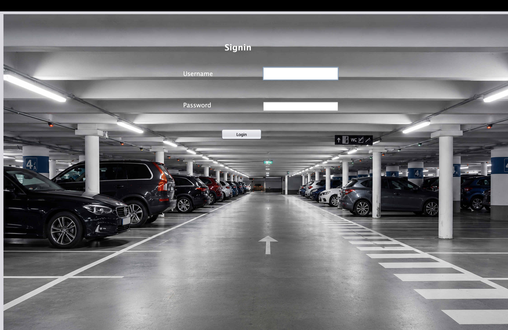
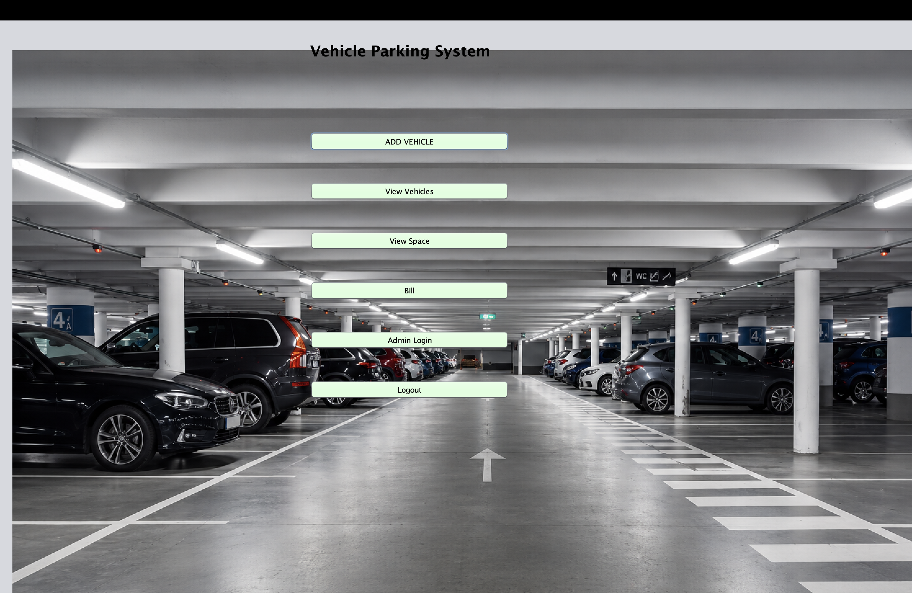
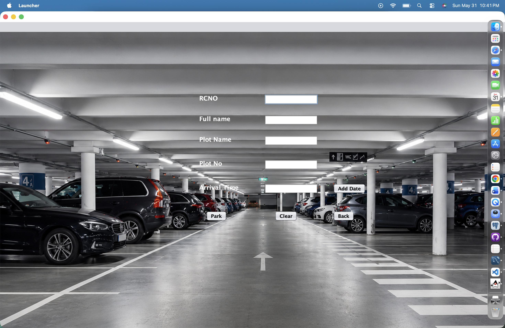
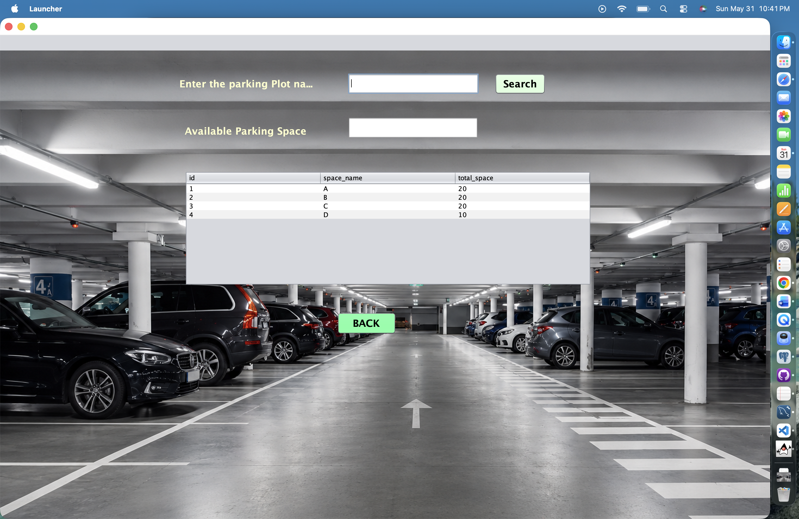
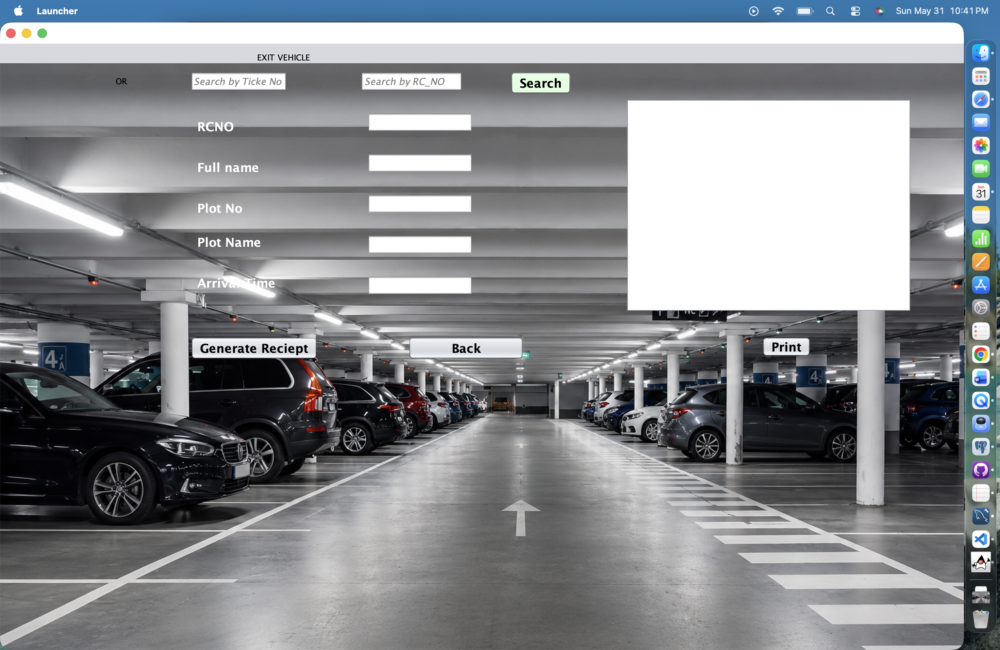
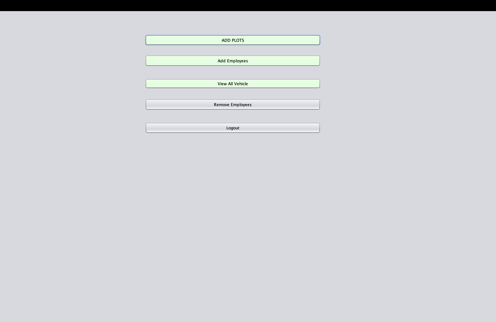
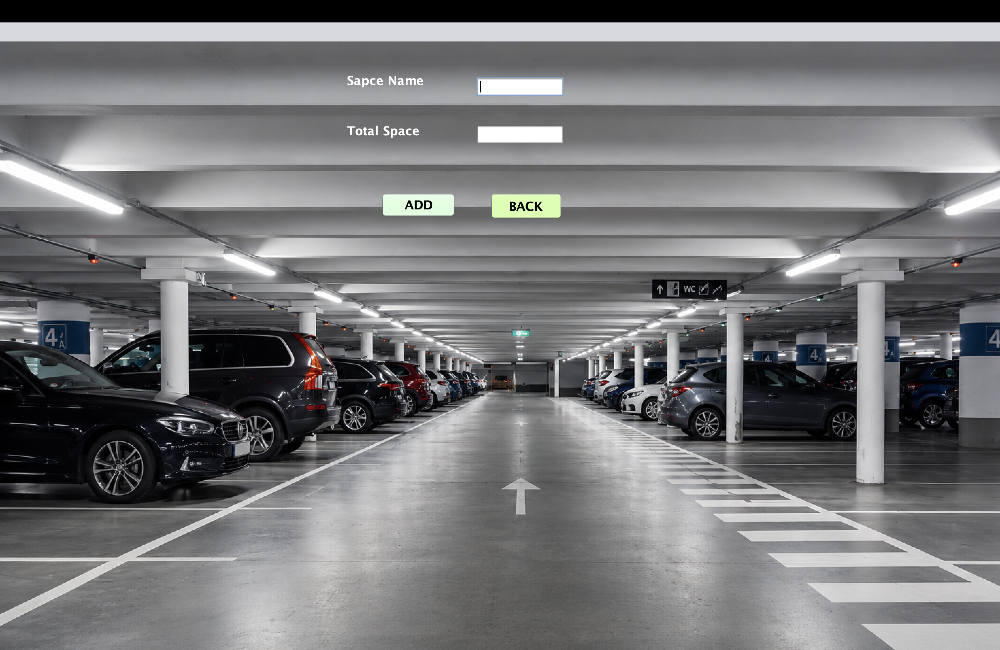
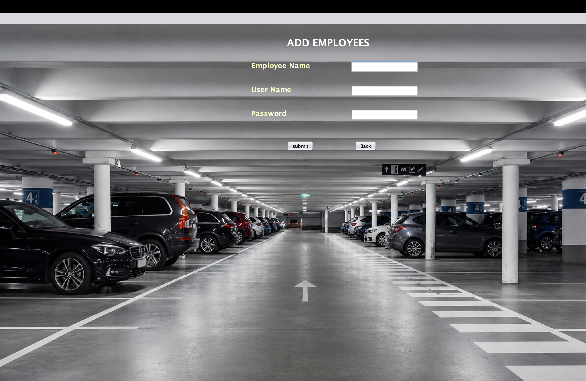
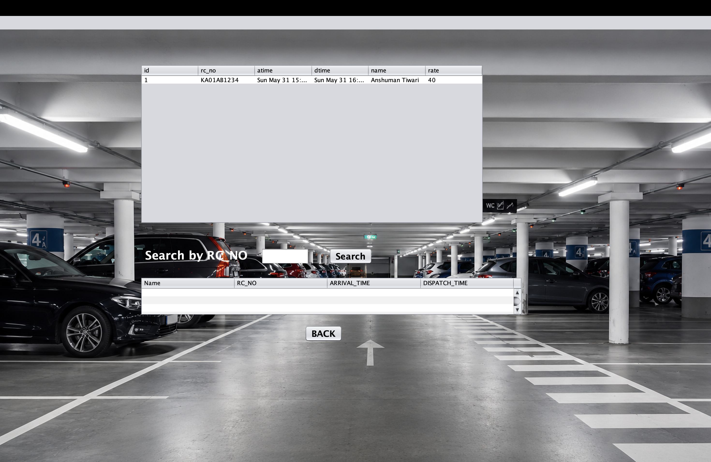
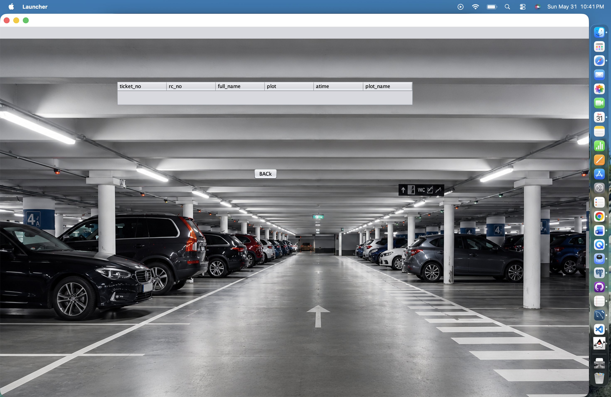

# Parking Management System

A Java Swing-based Parking Management System developed using JDBC and MySQL for managing vehicle parking, parking spaces, employees, and billing operations.


---

## Overview

The Parking Management System is a desktop application built using Java Swing and MySQL. It helps parking operators manage vehicle entries and exits, monitor parking space availability, maintain employee records, and generate parking receipts.

The application provides separate functionalities for employees and administrators, making parking lot operations easier and more organized.

---

## Features

### Authentication

* Employee Login
* Admin Login
* User Registration

### Parking Management

* Add Parking Spaces
* View Available Parking Spaces
* Park Vehicles
* Search Vehicle by Ticket Number
* Search Vehicle by RC Number
* Vehicle Exit Processing
* Receipt Generation

### Employee Management

* Add Employees
* Remove Employees
* Employee Authentication

### Vehicle Records

* View Currently Parked Vehicles
* View Vehicle Parking History
* Maintain Entry and Exit Logs

---

## Technology Stack

### Frontend

* Java Swing

### Backend

* Java
* JDBC

### Database

* MySQL 8.x

### Build Tool

* Maven

### IDE

* NetBeans / VS Code

---

## Screenshots

### Login Screen



### Employee Dashboard



### Add Vehicle



### Parking Space Availability



### Vehicle Billing & Exit



### Admin Login


### Admin Dashboard



### Add Parking Space



### Add Employee



### Remove Employee


### Vehicle History



### Vehicle Records



---

## Project Structure

```text
signup/
│
├── screenshots/
│
├── src/
│   ├── main/
│   │   ├── java/
│   │   │   └── com/mycompany/signup/
│   │   └── resources/
│   │       └── images/
│
├── database.sql
├── schema.sql
├── pom.xml
├── README.md
└── .gitignore
```

---

## Prerequisites

Before running the project, make sure you have:

* Java 19 or later
* MySQL 8.x
* Maven 3.x
* Git

---

## Database Tables

### login

Stores employee and admin login credentials.

| Column   | Type    |
| -------- | ------- |
| uname    | varchar |
| password | varchar |

### signup

Stores registered user details.

| Column   | Type    |
| -------- | ------- |
| id       | int     |
| fname    | varchar |
| lname    | varchar |
| uname    | varchar |
| passwd   | varchar |
| confpass | varchar |
| phno     | varchar |

### employee

Stores employee information.

| Column    | Type    |
| --------- | ------- |
| id        | int     |
| emp_name  | varchar |
| user_name | varchar |
| password  | varchar |

### park_space

Stores parking area information.

| Column      | Type    |
| ----------- | ------- |
| id          | int     |
| space_name  | varchar |
| total_space | int     |

### vehicle_details

Stores currently parked vehicles.

| Column    | Type    |
| --------- | ------- |
| ticket_no | int     |
| rc_no     | varchar |
| full_name | varchar |
| plot      | varchar |
| atime     | varchar |
| plot_name | varchar |

### all_vehicle

Stores vehicle history.

| Column | Type    |
| ------ | ------- |
| id     | int     |
| rc_no  | varchar |
| atime  | varchar |
| dtime  | varchar |
| name   | varchar |
| rate   | int     |

---

## Database Setup

### Create Database

```sql
CREATE DATABASE DBMS;
```

### Import Schema

```bash
mysql -u root -p DBMS < schema.sql
```

### Import Sample Data

```bash
mysql -u root -p DBMS < database.sql
```

### Configure Database Credentials

Update the MySQL username and password in the source code before running the application.

Example:

```java
DriverManager.getConnection(
    "jdbc:mysql://localhost/DBMS",
    "root",
    "YOUR_DB_PASSWORD"
);
```

---

## Build Project

```bash
mvn clean compile
```

---

## Run Project

```bash
mvn exec:java -Dexec.mainClass="com.mycompany.signup.login"
```

---

## Application Workflow

### Employee Workflow

1. Login
2. Add Vehicle
3. Search Vehicle
4. View Parking Availability
5. Generate Receipt
6. Vehicle Exit Processing

### Admin Workflow

1. Login
2. Add Parking Space
3. Add Employee
4. Remove Employee
5. View Vehicle Records
6. Monitor Parking Operations

---

## Author

### Anshuman Tiwari

Software Engineer | Java Developer | Full Stack Enthusiast

* GitHub: https://github.com/Anshuman-Tiwari-2002
* LinkedIn: https://www.linkedin.com/in/anshuman-tiwari-2002/

Developed as a Java Swing + MySQL Database Management System project.

---

## License

This project is intended for educational and learning purposes.
